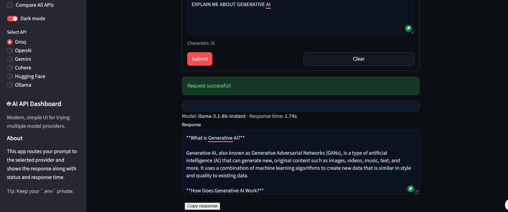
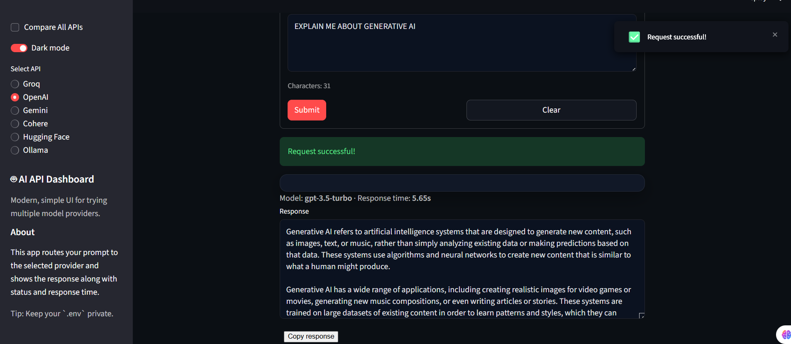
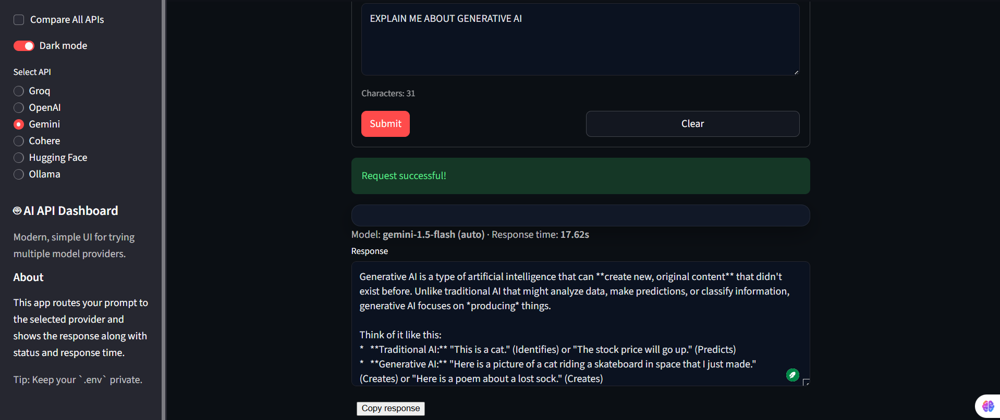
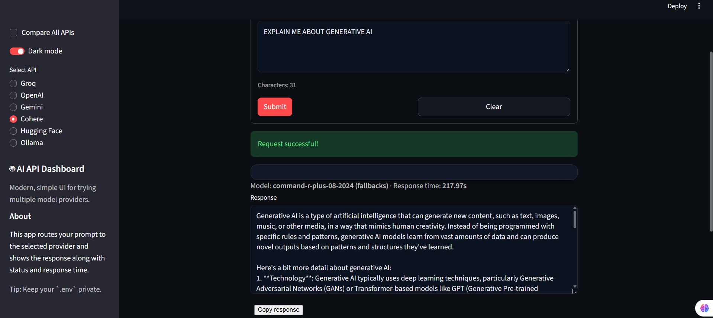
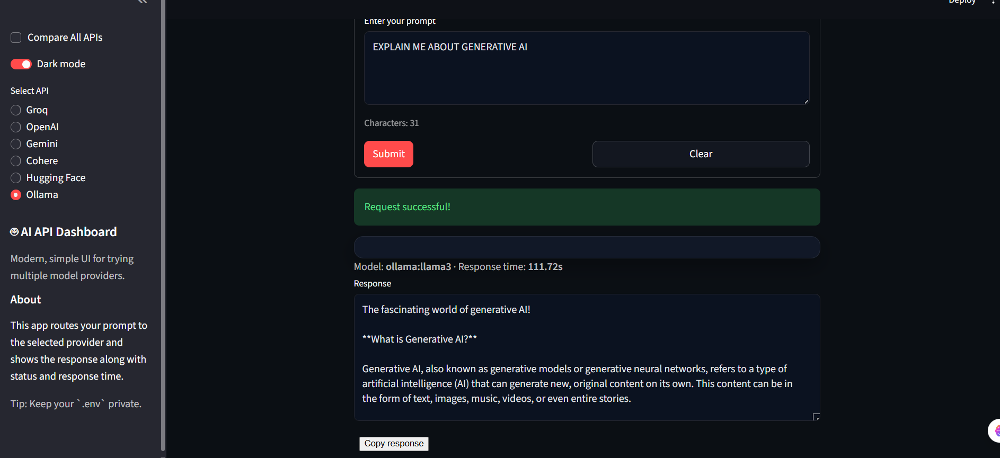

AI API Integration

Project description
- This is an assignment project where I connect one simple dashboard to multiple AI providers.
- It lets me send the same prompt and compare responses from:
  - Groq
  - OpenAI
  - Gemini
  - Cohere
  - Hugging Face Router
  - Ollama (local)
- I also saved the outputs for the prompt Explain me about generative AI in `generative_ai_model_outputs.md`.

Setup instructions
- Requirements
  - Python 3.10 or higher
  - `pip`
- Install dependencies
  - `cd "c:\Users\jarvi\OneDrive\Desktop\AI_API_Integration\ai-api-integration"`
  - `python -m pip install -r requirements.txt`
- Create your `.env` file (in this project folder)
  - Do not commit this file
  - Add:
    - `OPENAI_API_KEY=...`
    - `GROQ_API_KEY=...`
    - `HUGGINGFACE_API_KEY=...`
    - `GOOGLE_API_KEY=...`
    - `COHERE_API_KEY=...`

How to obtain each API key
- Groq
  - https://console.groq.com/keys/
- OpenAI
  - https://platform.openai.com/api-keys
- Gemini (Google AI Studio)
  - https://aistudio.google.com/app/apikey
- Cohere
  - https://dashboard.cohere.ai/api-keys
- Hugging Face
  - https://huggingface.co/settings/tokens
- Ollama
  - No API key required because it runs locally

How to run each program
- Groq
  - `python groq_example.py`
- OpenAI
  - `python openai_example.py`
- Gemini
  - `python gemini_example.py`
- Cohere
  - `python cohere_example.py`
- Hugging Face Router
  - `python huggingface_example.py`
- Ollama (local)
  - `ollama pull llama3`
  - `ollama serve`
  - `python ollama_example.py`
- Multi API menu
  - `python multi_api_query.py`

Run the Streamlit dashboard
- `python -m pip install streamlit`
- `streamlit run app.py`

Screenshots
- Single API runs
  - Groq
    - 
  - OpenAI
    - 
  - Gemini
    - 
  - Cohere
    - 
  - Hugging Face
    - 
  - Ollama
    - 
- Compare All APIs mode
  - 
  - 
  - Best response shown here
    - 
- Hugging Face inference providers screenshots (to show provider configuration)
  - 
  - 

Comparing all the models (based on the screenshots)
- Fastest API
  - In the compare screenshots, Groq is shown with the Fastest badge.
  - Example: the Groq card shows a lower response time than the other providers.
- Best Response
  - In the Best Response screenshot, the best response is shown as Gemini.
  - The reason it is picked as “best” in this app is based on the response content length (word count) logic used in the dashboard.
- General observation
  - Groq and OpenAI usually return clearer structured text for this question.
  - Gemini gives a longer “explanation style” response.
  - Cohere and Hugging Face also respond clearly, but they vary in structure and length.
  - Ollama works locally, but it can be slower (as seen in the screenshot response time).

Saved model outputs
- The prompt used:
  - EXPLAIN ME ABOUT GENERATIVE AI
- The saved outputs file:
  - `generative_ai_model_outputs.md`
- This file stores the response text I pasted from:
  - Groq
  - OpenAI
  - Gemini
  - Cohere
  - Hugging Face
  - Ollama

---

Note for the campus reviewer
- I ran into an issue with the Hugging Face part of the project.
- Initially I tried calling the older Hugging Face inference endpoint, but it failed.
- After troubleshooting, I switched the Hugging Face example to use the Hugging Face Router (OpenAI-compatible endpoints) and a model that is accessible with my current enabled providers, so the app works now.
- If you have a better/official solution for the original Hugging Face issue, please let me know.
- What solution would you suggest for the reviewer so the Hugging Face part works reliably?

